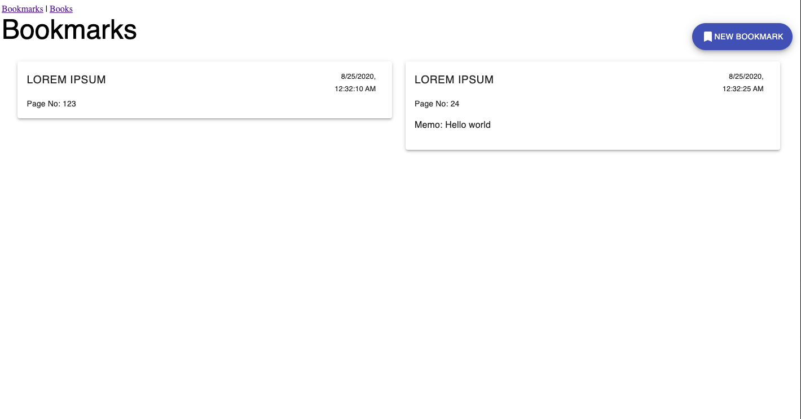

# The Shiories

## Overview

The Shiories is a web application for store your impression and details of what you read.
You can also share and export it in the below formats.
- CSV
- Article reference
- JSON

## Installation
npx install or yarn install
npx build or yarn build
npx start or yarn start

## Update history
2019/12/11 initialize project(clone form with-typescript sample)

